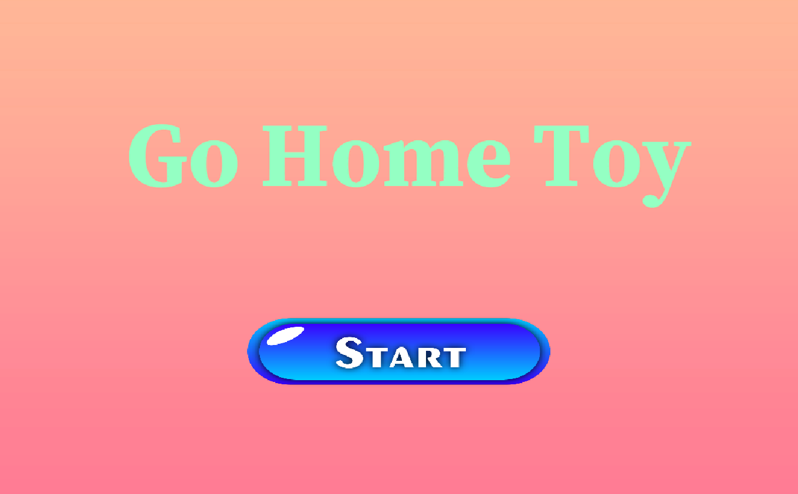
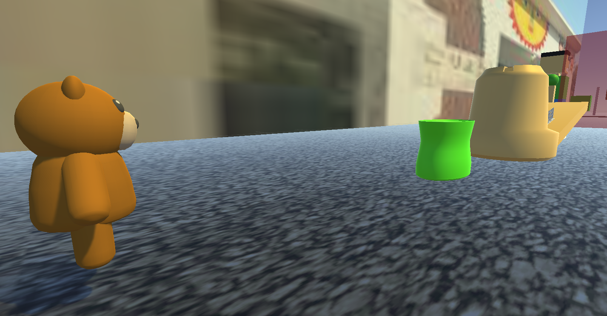
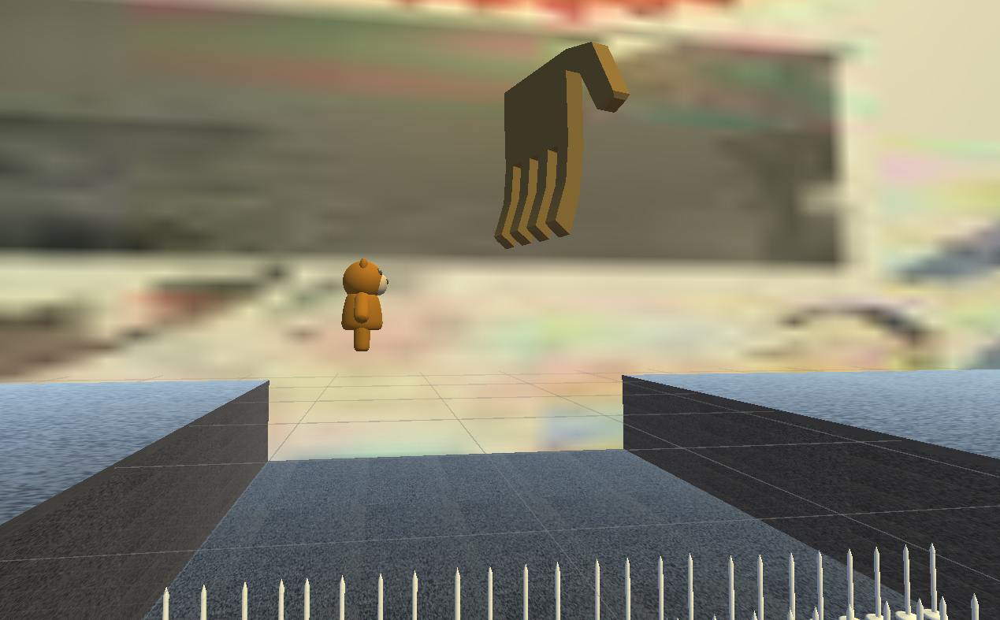
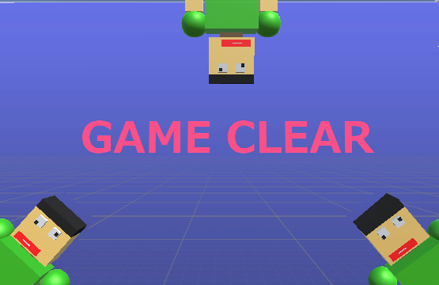

# Gohometoy

## ファイル構成
[Unityデータ]
[ビルドデータ]

##概要

## ジャンル
横スクロールアクション

## プラットフォーム
[Androidビルドデータ]
[Windowsビルドデータ]

## ゲームストーリ
子供が持っていた人形が帰り際に落ちてしまい、落ちた人形は持ち主である子供のもとへ戻る

## ゲームルール
障害となるオブジェクトと持ち主以外の人の視線に当たらないようにする

## Unityバージョン
3.7

## 製作期間
約2か月

## メンバー
*國吉蒼天
*伊敷蒼
*大城侑

## ゲームスクリーンショット

![敵の視界]Enemyeye(./ScreenShot/Enemyeye.png)

